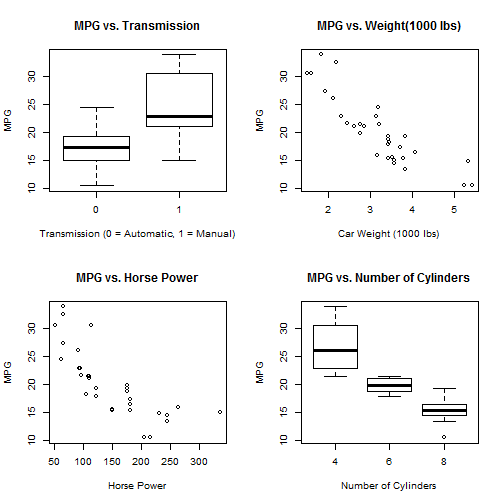

Predicting Fuel Efficiency of Car
========================================================
author: Bipika Amatya
date: 25 February, 2016

Introduction
========================================================
The most important thing while purchasing a car is to be cautiuos for perfomance details such as its fuel efficiency.

Fuel efficiency has always been a major concern to car owners as well as the enviromentalist. 

For car owners, fuel efficiency reduces thier cost. While, for the enviromentalist, lesser emission results in slower depletion to natural resources. 

Data used
========================================================
Here, "mtcars" data has been used which contains 11 specifications of 32 cars.

```r
#Sample data
mtcars[1:3, 1:6]
```

```
               mpg cyl disp  hp drat    wt
Mazda RX4     21.0   6  160 110 3.90 2.620
Mazda RX4 Wag 21.0   6  160 110 3.90 2.875
Datsun 710    22.8   4  108  93 3.85 2.320
```
The most significant impact on fuel efficiency are from Number of Cylinders, Horse Power, Weight (1000 lbs) and Transmission Type. These specification of the car has been considered here.

Plot to show effects
========================================================



Prediction on Car Fuel Efficiency
========================================================
This application allows you to enter you car specs and make a prediction of the fuel efficiency of you car.


You will need to enter the car specs:
- Number of Cyclinder
- Horse Power
- Car Weight (1000 lbs)
- Transmission Type

Then, click on the SUBMIT button.

The shiny app will calculate and display the average fuel efficiency (in terms of MPG - Miles Per Gallon) of your car.


Shiny App
========================================================
A Shiny application is developed to predict the fuel efficiency of a car when user enters those 4 car specs.

You can find my Shiny App working : [ShinyApp] (https://bipika.shinyapps.io/myshinyapp/).

Source code is available on the [GitHub](https://github.com/bipika/Developing-Data-Product-Project).

Presentation available on [rPubs] (http://rpubs.com/bipika/myshinyapp).
